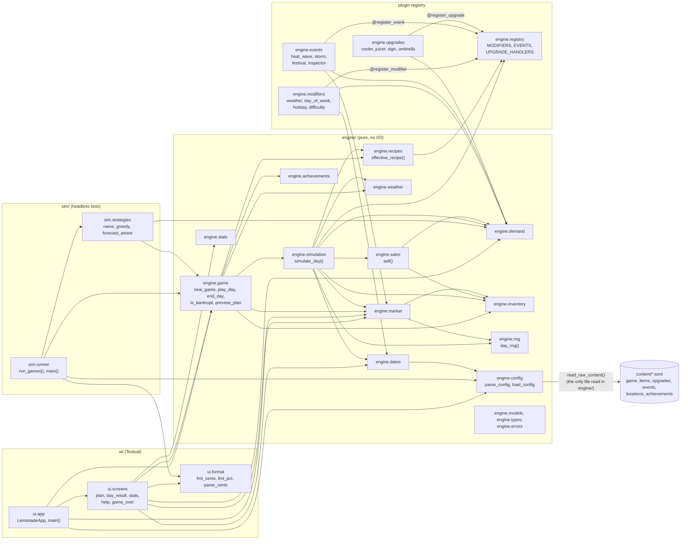
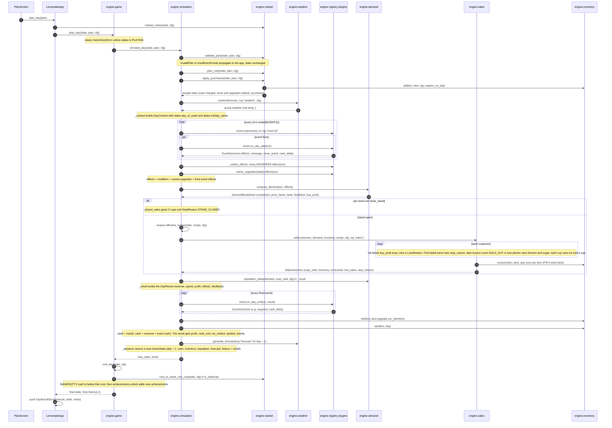
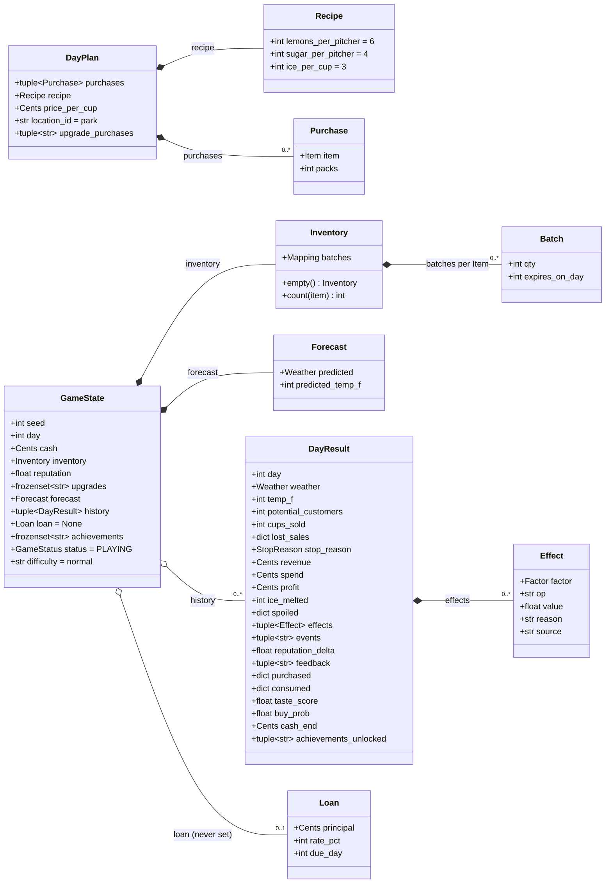

# Architecture

Three diagrams of the code as it is in `src/`: which components depend on which, how one day runs,
and the core data model. Every node was checked against the source; the table at the end lists the
file behind each one. They were drawn from the code (imports extracted with Python's `ast`, fields
read from the dataclasses), not from CLAUDE.md. Where the code differs from CLAUDE.md, the diagrams
follow the code (see "Where the code differs from CLAUDE.md §6" below).

## 1. Components

Arrows mean "imports and calls at runtime". Imports used only for type hints (`if TYPE_CHECKING:`)
are left out, e.g. the screens' import of `ui.app`. Nearly every module imports `engine.models` and
`engine.types`, so those arrows are omitted too. Other edges are a real subset, not the complete
graph.

Notes:

- **Plugins register at import time.** `engine/__init__.py` imports the `modifiers`, `events` and
  `upgrades` packages, and each package's `__init__.py` imports its plugin modules. Their decorators
  fill the registry dicts.
- **`sim.runner` depends on `ui.format`** for money and percent formatting in the balance report.
  It's the only place tooling depends on the UI package.
- **The UI reaches into several engine modules**, not only `game`:
  - `market`: `todays_pack_prices`, `market_notes`, `purchase_cost`, `discount_pct`;
  - `demand`: `recipe_score` in the Plan screen, and `fmt_mul` in `day_result`;
  - `dates`: day names and holidays;
  - `stats`: the Stats and Game over screens.

## 2. One day: `game.play_day`

This is the real call order in `engine/game.py` and `engine/simulation.py` (`simulate_day` and its
private helpers `_context`, `_fire_start_events`, `_collect_effects`, `_run_sales`, `_result`,
`_upkeep` and `_advance`). Each random step uses its own seeded stream from `rng.day_rng`, shown
as `rng "..."`.

### Where the code differs from CLAUDE.md §6

CLAUDE.md §6 lists 13 pipeline steps. The code differs in four places, and the diagram follows the
code:

1. **Purchases and upgrades are one call.** Buying supplies (§6 step 2) and upgrades (step 3) both
   happen in `market.apply_purchases`.
2. **The reputation change is computed early.** It's computed in `_result`, *before* the end-of-day
   events (§6 step 9) and upkeep (step 10). It's applied to the state in `_advance`.
3. **Bankruptcy and achievements are outside `simulate_day`.** They happen in `game.end_day`,
   called by `game.play_day` after `simulate_day` returns. This was Phase 0 decision D3, which
   avoids a circular import between `game` and `simulation`.
4. **Loan interest and fees don't exist.** They appear in §6 step 10, but there's no loan or fee
   logic in `_upkeep`. `GameState.loan` exists but is never set (see §3 below).

## 3. Core data model

All of these are `@dataclass(frozen=True, slots=True)` in `engine/models.py`. Fields and types are
copied from the dataclass definitions, including fields that have defaults. `Cents` is an alias for
`int`. `Item`, `Weather`, `Factor`, `LossReason`, `StopReason` and `GameStatus` are `StrEnum`s in
`engine/types.py`.

Types simplified in the diagram (to keep the Mermaid syntax portable):

- `Inventory.batches` is `Mapping[Item, tuple[Batch, ...]]`.
- `Batch.expires_on_day` and `GameState.loan` are optional (`int | None` and `Loan | None`, where
  `None` means "never expires" and "no loan").
- `DayResult.stop_reason` is `StopReason | None`.
- `DayResult.lost_sales` is `dict[LossReason, int]`. `spoiled`, `purchased` and `consumed` are
  `dict[Item, int]`.
- `Effect.op` is `Literal["mul", "add"]`.
- `upgrade_purchases`, `achievements`, `status`, `difficulty`, `location_id` and the later
  `DayResult` fields from `purchased` on all have defaults.

How they're used:

- **`simulation.simulate_day(state, plan, cfg)`** takes a `GameState` and a `DayPlan`, and returns
  a new `GameState` plus a `DayResult`. The input state is never modified.
- **Mutable-looking fields.** `Inventory.batches` and the dict fields on `DayResult` are plain
  dicts, read-only by convention (Phase 0 decision D10). Every change builds a new one.
- **How `Batch` expiry works.** `expires_on_day` is the last day a batch can be used.
  `inventory.spoil(inv, day)` drops batches with `expires_on_day <= day`, and `inventory.consume`
  takes stock oldest-expiry first.
- **Other models not drawn.** `engine/models.py` also defines `EventOutcome`, `DayContext` and
  `PlanPreview`. They're left out because they aren't part of the core model you asked for.

## Verification: every node and where it lives

| Diagram node | Real code |
|---|---|
| `ui.app`: `LemonadeApp`, `main()`, `start_day` | `src/lemonade/ui/app.py` |
| `ui.screens`: `PlanScreen`, `DayResultScreen`, stats, help, game_over | `src/lemonade/ui/screens/{plan,day_result,stats,help,game_over}.py` |
| `ui.format` | `src/lemonade/ui/format.py` |
| `sim.runner`: `run_games`, `main` | `src/lemonade/sim/runner.py` |
| `sim.strategies`: `naive`, `greedy`, `forecast_aware` | `src/lemonade/sim/strategies.py` |
| `engine.game`: `new_game`, `play_day`, `end_day`, `is_bankrupt`, `preview_plan` | `src/lemonade/engine/game.py` |
| `engine.simulation`: `simulate_day` and its helpers | `src/lemonade/engine/simulation.py` |
| `engine.market`: `validate_plan`, `plan_cost`, `apply_purchases`, `market_notes`, `cost_to_make_one_cup` | `src/lemonade/engine/market.py` |
| `engine.weather`: `resolve`, `generate_forecast` | `src/lemonade/engine/weather.py` |
| `engine.demand`: `compute_demand`, `reputation_delta` | `src/lemonade/engine/demand.py` |
| `engine.sales`: `sell`, `SalesOutcome` | `src/lemonade/engine/sales.py` |
| `engine.inventory`: `add`, `consume`, `melt`, `spoil` | `src/lemonade/engine/inventory.py` |
| `engine.recipes`: `effective_recipe` | `src/lemonade/engine/recipes.py` |
| `engine.dates`: `day_of_week`, `holiday_name` | `src/lemonade/engine/dates.py` |
| `engine.achievements`: `unlock` | `src/lemonade/engine/achievements.py` |
| `engine.stats` | `src/lemonade/engine/stats.py` |
| `engine.rng`: `day_rng` | `src/lemonade/engine/rng.py` |
| `engine.config`: `parse_config`, `read_raw_content`, `load_config` | `src/lemonade/engine/config.py` |
| `engine.models`, `engine.types`, `engine.errors` | `src/lemonade/engine/{models,types,errors}.py` |
| `engine.registry`: `MODIFIERS`, `EVENTS`, `UPGRADE_HANDLERS`, `active_upgrades` | `src/lemonade/engine/registry.py` |
| modifiers: weather, day_of_week, holiday, difficulty | `src/lemonade/engine/modifiers/*.py` |
| events: heat_wave, storm, festival, inspector | `src/lemonade/engine/events/*.py` |
| upgrades: cooler, juicer, sign, umbrella | `src/lemonade/engine/upgrades/*.py` |
| content TOML (6 files) | `src/lemonade/content/*.toml`, listed in `config.CONTENT_FILES` |
| `GameState`, `Inventory`, `Batch`, `Recipe`, `DayPlan`, `Purchase`, `Forecast`, `Loan`, `DayResult`, `Effect` | `src/lemonade/engine/models.py` |
